# End-to-End ML Deployment with CI/CD Pipeline

> **A complete MLOps project showcasing automated deployment of a Machine Learning application to AWS EC2 using Docker, GitHub Actions, and ECR.**

This project demonstrates **production-grade ML deployment** with continuous integration and delivery. It features a student performance prediction model deployed as a Flask web application with fully automated CI/CD pipeline.

[](https://github.com/aashishkumar-tech/mlproject/actions/workflows/ec2-deploy.yml)


🔗 **Live Production Deployment**: <http://34.228.159.84/>

---

## 🎯 Project Highlights

**This project focuses on MLOps and Cloud Deployment, featuring:**

- ✅ **Complete CI/CD Pipeline**: Automated testing → Docker build → ECR push → EC2 deployment
- ✅ **AWS Cloud Infrastructure**: EC2, ECR, IAM, Security Groups, and VPC configuration
- ✅ **Containerization**: Docker multi-stage builds with optimized image size
- ✅ **Infrastructure as Code**: GitHub Actions workflow for automated deployments
- ✅ **Production Best Practices**: Gunicorn WSGI server, health checks, logging, monitoring
- ✅ **Zero-Downtime Deployment**: Automated container replacement with health verification
- ✅ **Cost-Optimized**: Runs on AWS Free Tier (t2.micro)

---

## 📋 Table of Contents

- [Deployment Architecture](#-deployment-architecture)
- [Features](#-features)
- [Tech Stack](#-tech-stack)
- [CI/CD Pipeline](#-cicd-pipeline)
- [Quick Start](#-quick-start)
- [AWS Deployment Guide](#-aws-deployment-guide)
- [Project Structure](#-project-structure)
- [Documentation](#-documentation)
- [Contributing](#-contributing)
- [License](#-license)

---

## 🏗️ Deployment Architecture

```
GitHub Repository (Push to main)
          ↓
GitHub Actions Workflow
          ↓
    ┌─────┴─────┐
    │           │
   CI Job    Build & Push to ECR
    │           │
    └─────┬─────┘
          ↓
    Deploy to EC2
          ↓
    Docker Container
          ↓
  Flask App (Production)
```

**Deployment Flow**:

1. Code pushed to `main` branch triggers GitHub Actions
2. CI job runs tests and linting
3. Docker image built and pushed to AWS ECR with version tags
4. SSH deployment to EC2 pulls latest image
5. Old container stopped, new container started with health check
6. Application live at public IP with zero downtime

---

## ✨ Features

### Deployment & DevOps

- **Automated CI/CD**: Push code → Auto-deploy to production in ~3 minutes
- **Docker Containerization**: Consistent environments from dev to production
- **AWS ECR Integration**: Private container registry with image versioning
- **Blue-Green Deployment**: Zero-downtime container replacement
- **Health Monitoring**: Automated health checks post-deployment
- **Security Best Practices**: IAM roles, Security Groups, encrypted secrets

### Application Features

- **ML Prediction API**: Student math score prediction based on 7 features
- **Web Interface**: Responsive Flask UI with form validation
- **RESTful Architecture**: Clean API design for future integrations
- **Production Logging**: Comprehensive logging for debugging and audit trails
- **Error Handling**: Custom exception framework with detailed error reporting

---

## 🛠️ Tech Stack

### DevOps & Cloud Infrastructure (Primary Focus)

| Component | Technology | Purpose |
|-----------|-----------|---------|
| **Container Platform** | Docker | Application containerization |
| **CI/CD** | GitHub Actions | Automated build, test, and deployment |
| **Container Registry** | AWS ECR | Private Docker image storage |
| **Compute** | AWS EC2 (t2.micro) | Production application hosting |
| **Networking** | AWS VPC, Security Groups | Network isolation and security |
| **IAM** | AWS IAM | Access management and permissions |
| **WSGI Server** | Gunicorn | Production-grade Python app server |
| **Version Control** | Git/GitHub | Source code management |

### Application Stack

| Component | Technology | Purpose |
|-----------|-----------|---------|
| **Language** | Python 3.10 | Core programming language |
| **Web Framework** | Flask | HTTP server and routing |
| **ML Framework** | scikit-learn | Model training and preprocessing |
| **Data Processing** | pandas, numpy | Data manipulation |
| **Model Storage** | dill, pickle | Model serialization |

---

## 🔄 CI/CD Pipeline

### Pipeline Overview

```yaml
Trigger: Push to main branch
  ↓
┌─────────────────────────────────────────────────────────┐
│ Job 1: Continuous Integration (CI)                      │
│ • Checkout code                                         │
│ • Setup Python 3.10                                     │
│ • Install dependencies                                  │
│ • Run tests & linting                                   │
│ • Validate code quality                                 │
└─────────────────────────────────────────────────────────┘
  ↓ (Only if CI passes)
┌─────────────────────────────────────────────────────────┐
│ Job 2: Build & Push to ECR                             │
│ • Configure AWS credentials                             │
│ • Login to Amazon ECR                                   │
│ • Build Docker image                                    │
│ • Tag with git SHA & latest                            │
│ • Push to ECR registry                                  │
│ • Time: ~1m 43s                                         │
└─────────────────────────────────────────────────────────┘
  ↓ (After successful push)
┌─────────────────────────────────────────────────────────┐
│ Job 3: Deploy to EC2                                    │
│ • SSH to EC2 instance                                   │
│ • Pull latest image from ECR                           │
│ • Stop old container gracefully                         │
│ • Start new container on port 80                       │
│ • Run health check                                      │
│ • Clean up old images                                   │
│ • Time: ~9s                                             │
└─────────────────────────────────────────────────────────┘
  ↓
✅ Deployed to Production: http://34.228.159.84/
```

### Pipeline Features

- **Parallel Execution**: CI runs on all branches; deployment only on main
- **Automated Rollback**: Deployment fails if health check doesn't pass
- **Version Tagging**: Each deployment tagged with git commit SHA
- **Secret Management**: AWS credentials stored as GitHub encrypted secrets
- **Monitoring**: Build status visible via GitHub Actions badge

---

## 🚀 Quick Start

### Local Development

#### Prerequisites

- Python 3.10+
- Git
- Docker (optional, for local container testing)

#### 1️⃣ Clone the Repository

```bash
git clone https://github.com/aashishkumar-tech/mlproject.git
cd mlproject
```

#### 2️⃣ Create Virtual Environment

**Windows (PowerShell)**:

```powershell
python -m venv venv
.\venv\Scripts\Activate.ps1
```

**macOS / Linux**:

```bash
python3 -m venv venv
source venv/bin/activate
```

#### 3️⃣ Install Dependencies

```bash
pip install -r requirements.txt
```

#### 4️⃣ Run the Application Locally

```bash
python app.py
```

Visit: <http://localhost:8080>

---

## ☁️ AWS Deployment Guide

### Complete Setup from Scratch

This project includes **step-by-step AWS setup instructions**. Follow the guide to deploy your own instance:

📖 **[AWS-SETUP-GUIDE.md](AWS-SETUP-GUIDE.md)** - Complete AWS deployment walkthrough

**What you'll create**:

1. ✅ IAM user with ECR permissions
2. ✅ ECR repository for Docker images
3. ✅ EC2 Security Group with proper rules
4. ✅ EC2 Key Pair for SSH access
5. ✅ EC2 t2.micro instance (Free Tier)
6. ✅ Docker and AWS CLI installation
7. ✅ GitHub Secrets configuration
8. ✅ Automated deployment pipeline

**Time to deploy**: ~30 minutes for first-time setup

### Quick Deploy (If AWS is already configured)

```bash
# 1. Configure GitHub Secrets (in repo settings)
AWS_ACCESS_KEY_ID
AWS_SECRET_ACCESS_KEY
AWS_REGION
ECR_REGISTRY
ECR_REPOSITORY
EC2_HOST
EC2_USER
EC2_SSH_KEY

# 2. Push to main branch
git add .
git commit -m "deploy: initial deployment"
git push origin main

# 3. GitHub Actions automatically deploys to EC2
# Check workflow: https://github.com/aashishkumar-tech/mlproject/actions
```

---

## 🐳 Docker

### Local Docker Testing

```bash
# Build image
docker build -t mlproject:local .

# Run container
docker run -d -p 80:8080 --name mlproject mlproject:local

# Test
curl http://localhost

# View logs
docker logs mlproject

# Stop container
docker stop mlproject
docker rm mlproject
```

### Docker Configuration

**Dockerfile highlights**:

- Base image: `python:3.10-slim`
- Multi-stage optimization
- 2 Gunicorn workers (optimized for 1GB RAM)
- 120s timeout (for model loading)
- Port 8080 exposed

---

## 📁 Project Structure

**Focus: DevOps & Deployment Components**

```text
mlproject/
├── .github/
│   └── workflows/
│       └── ec2-deploy.yml          # ⭐ CI/CD Pipeline (3 jobs)
├── Dockerfile                      # ⭐ Container configuration
├── docker-compose.yml              # ⭐ Local development setup
├── .dockerignore                   # Build optimization
├── AWS-SETUP-GUIDE.md             # ⭐ Complete AWS setup guide
├── .markdownlint.json             # Markdown linting config
├── requirements.txt                # Python dependencies
├── app.py                          # Flask application
├── src/                           # ML pipeline code
│   ├── components/                # Training components
│   ├── pipeline/                  # Inference pipeline
│   └── utils.py                   # Helper functions
├── templates/                     # HTML templates
├── static/                        # CSS files
├── artifacts/                     # Model files (included in Docker)
└── logs/                          # Application logs
```

---

## 📊 CI/CD Workflow Visualization

**File**: `.github/workflows/ec2-deploy.yml`

```mermaid
graph LR
    A[Git Push] --> B{GitHub Actions}
    B --> C[CI Job<br/>Tests & Lint]
    C -->|Pass| D[Build Job<br/>Docker Build]
    D --> E[Push to ECR<br/>Tag: SHA & latest]
    E --> F[Deploy Job<br/>SSH to EC2]
    F --> G[Pull Image]
    G --> H[Stop Old Container]
    H --> I[Start New Container]
    I --> J[Health Check]
    J -->|Pass| K[✅ Live Production]
    J -->|Fail| L[❌ Rollback]
```



**Total Pipeline Time**: ~3 minutes from push to production

---

## 📚 Documentation

Comprehensive documentation for different audiences:

| Document | Audience | Description |
|----------|----------|-------------|
| **[README.md](README.md)** | Everyone | Project overview and quick start |
| **[AWS-SETUP-GUIDE.md](AWS-SETUP-GUIDE.md)** | DevOps Engineers | Complete AWS deployment walkthrough |
| **[HLD.md](HLD.md)** | Architects | High-level system design and architecture |
| **[TECHNICAL_DOC.md](TECHNICAL_DOC.md)** | Developers | Code structure and implementation details |
| **[API_DOCS.md](API_DOCS.md)** | API Users | API endpoints and usage examples |
| **[CONTRIBUTING.md](CONTRIBUTING.md)** | Contributors | Contribution guidelines and coding standards |

---

## 🎯 Project Goals & Learning Outcomes

### DevOps Skills Demonstrated

✅ **CI/CD Pipeline Design**: Multi-stage GitHub Actions workflow  
✅ **Containerization**: Docker best practices and optimization  
✅ **Cloud Infrastructure**: AWS EC2, ECR, IAM, VPC configuration  
✅ **Automation**: Automated testing, building, and deployment  
✅ **Security**: IAM roles, encrypted secrets, security groups  
✅ **Monitoring**: Health checks, logging, and error tracking  
✅ **Documentation**: Comprehensive technical documentation  
✅ **Version Control**: Git workflows and branching strategies  

### Why This Project Stands Out

1. **Production-Grade**: Not just code that works, but code that deploys automatically
2. **End-to-End**: From local development to production deployment
3. **Best Practices**: Follows industry standards for DevOps and MLOps
4. **Documented**: Every step explained with detailed documentation
5. **Cost-Effective**: Runs on AWS Free Tier
6. **Portfolio-Ready**: Demonstrates real-world deployment skills

---

## 🔧 Troubleshooting

### Common Deployment Issues

**Worker Timeout Errors**:

```bash
# Check Docker logs on EC2
ssh ec2-user@YOUR_EC2_IP
docker logs mlproject --tail 100
```

**Solution**: Increase Gunicorn timeout in Dockerfile (already set to 120s)

**Missing Model Files**:

- Ensure `artifacts/` is NOT in `.dockerignore`
- Check that model.pkl and preprocessor.pkl exist

**SSH Authentication Failed**:

- Verify EC2_SSH_KEY secret contains full .pem content
- Include BEGIN and END lines

**AWS Credentials Error**:

- Rotate IAM access keys
- Update GitHub Secrets

📖 **Full troubleshooting guide**: See [TECHNICAL_DOC.md](TECHNICAL_DOC.md)

---

## 💰 Cost Breakdown

### AWS Free Tier (First 12 months)

- EC2 t2.micro: 750 hours/month - **$0.00**
- ECR Storage: 500MB/month - **$0.00**
- Data Transfer: 1GB/month - **$0.00**

### After Free Tier

- EC2 t2.micro 24/7: ~$8.50/month
- ECR Storage (5GB): ~$0.50/month
- Data Transfer (10GB): ~$0.90/month
- **Total**: ~$10/month

**Cost Optimization Tips**:

- Stop EC2 when not in use (~$0.01/hour)
- Use reserved instances for 30-70% savings
- Clean up old Docker images regularly

---

## 🚀 Future Enhancements

### Phase 1: Infrastructure

- [ ] Add Application Load Balancer
- [ ] Implement Auto Scaling Groups
- [ ] Set up CloudWatch monitoring and alarms
- [ ] Enable HTTPS with SSL certificate
- [ ] Configure custom domain with Route 53

### Phase 2: MLOps

- [ ] Integrate MLflow for experiment tracking
- [ ] Add model versioning and A/B testing
- [ ] Implement model retraining pipeline
- [ ] Set up model performance monitoring
- [ ] Add feature store (AWS SageMaker)

### Phase 3: Advanced Features

- [ ] Kubernetes deployment (EKS)
- [ ] Terraform IaC implementation
- [ ] Multi-region deployment
- [ ] Blue-green deployment strategy
- [ ] Canary releases

---

## 🤝 Contributing

Contributions are welcome! Please see [CONTRIBUTING.md](CONTRIBUTING.md) for:

- Code of conduct
- Development setup
- Coding standards
- Pull request process

---

## 📜 License

This project is licensed under the MIT License - see the [LICENSE](LICENSE) file for details.

---

## 👨‍💻 Author

**Aashish Kumar**

**Skills Demonstrated**: Python • Flask • Docker • AWS (EC2, ECR, IAM) • GitHub Actions • CI/CD • MLOps • DevOps

---

## 🌟 Acknowledgments

- AWS Free Tier for hosting infrastructure
- GitHub Actions for CI/CD platform
- Open-source community for tools and libraries

---

## 📧 Contact & Support

- **GitHub Issues**: [Open an issue](https://github.com/aashishkumar-tech/mlproject/issues)
- **Email**: aashishkumar.tech@gmail.com
- **Documentation**: Check the docs/ folder
- **Live Demo**: <http://34.228.159.84/>

---

## 📈 Project Stats


---

**⭐ If you find this project useful for learning MLOps and DevOps, please star it on GitHub!**

---

## 🎬 Demo

**Live Application**: [http://34.228.159.84/](http://34.228.159.84/)

### Usage

1. Visit the live application
2. Click "Get Started" to access prediction form
3. Fill in student information
4. Get instant math score prediction

---

## 📖 How to Use This Project

### For Learning DevOps/MLOps

1. Clone and explore the `.github/workflows/ec2-deploy.yml` file
2. Review `Dockerfile` and `.dockerignore` for containerization best practices
3. Follow [AWS-SETUP-GUIDE.md](AWS-SETUP-GUIDE.md) to deploy your own instance
4. Modify and push code to see CI/CD in action

### For Portfolio/Resume

- Showcase automated deployment skills
- Demonstrate AWS cloud infrastructure knowledge
- Highlight CI/CD pipeline design
- Show Docker containerization expertise

### For Job Interviews

Talk about:

- How you designed the 3-stage CI/CD pipeline
- Why you chose specific AWS services (EC2 vs Lambda, ECR vs Docker Hub)
- How you optimized Docker images and Gunicorn configuration
- Security considerations (IAM, Security Groups, encrypted secrets)
- Cost optimization strategies for production deployment

### Logging

Logs are stored in `logs/` directory with timestamps.

---

## 🤝 Contributing

Contributions are welcome! Please:

1. Fork the repository
2. Create a feature branch (`git checkout -b feature/amazing-feature`)
3. Commit your changes (`git commit -m 'Add amazing feature'`)
4. Push to the branch (`git push origin feature/amazing-feature`)
5. Open a Pull Request

---

## 📝 License

This project is licensed under the MIT License - see the [LICENSE](LICENSE) file for details.

---

## 👨‍💻 Author

**Aashish Kumar**

---

## 🙏 Acknowledgments

- Dataset: Student Performance Dataset
- Inspiration: End-to-end ML project deployment
- Cloud Platform: AWS Free Tier

---

## 📧 Support

For issues and questions:

- Open an [Issue](https://github.com/aashishkumar-tech/mlproject/issues)
- Check the [Documentation](#-documentation)

---

## 🔮 Future Enhancements

- [ ] Add authentication and user management
- [ ] Implement model versioning with MLflow
- [ ] Add unit tests and integration tests
- [ ] Set up monitoring with Prometheus/Grafana
- [ ] Add custom domain with HTTPS
- [ ] Implement A/B testing for model comparison
- [ ] Create REST API with FastAPI
- [ ] Add real-time prediction streaming

---

**⭐ If you find this project useful, please star it on GitHub!**
